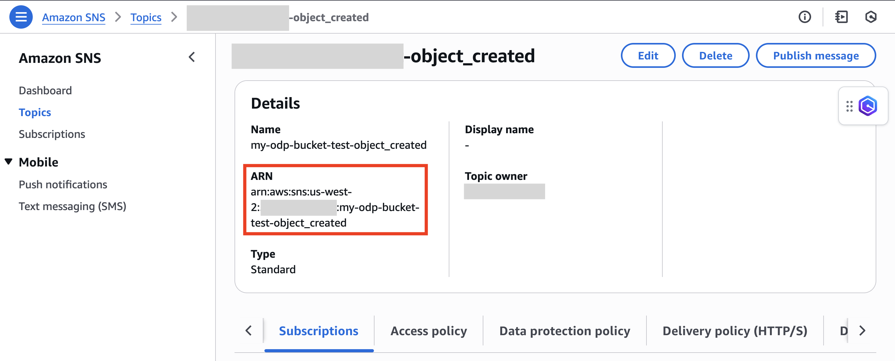

# Adding Your SNS Topic to the Registry of Open Data (RODA)

## Overview

This guide walks you through how to add your dataset’s SNS topic Amazon Resource Name (ARN) to your dataset entry on the [Registry of Open Data on AWS (RODA)](https://registry.opendata.aws). We’ll use the [Cell Painting Gallery dataset](https://registry.opendata.aws/cellpainting-gallery/) as an example to demonstrate the process.

Adding your SNS topic to RODA ensures data consumers can subscribe to notifications when new data is published. This enables them to automate downstream workflows using services like Amazon SQS or AWS Lambda.

---

## Step 1: Check if an SNS topic was created via CloudFormation

If you followed the [AWS Open Data Sponsorship Program Onboarding Handbook](https://assets.opendata.aws/aws-onboarding-handbook-for-data-providers.pdf), a CloudFormation template may have launched an SNS topic in your Open Data Program (ODP) AWS account.

1. Sign in to the AWS Management Console.
2. Switch to the Region where your dataset bucket resides (default is `us-west-2`).

   
3. Search for and select **CloudFormation**.

   
4. Look for a stack named `pds-buckets`. If named differently, select the correct stack. If no stack is found, try other Regions. If none exist, proceed to Step 2.

   
5. Click the **Outputs** tab.

   
6. If you see a key named `SNSTopic`, copy the ARN value. You’ll use it in Step 4.

   
   - If no SNS topic is listed, continue to Step 2.

---

## Step 2: Check if your dataset bucket has an SNS topic configured

If a CloudFormation stack wasn’t used, your dataset bucket may still have event notifications configured to publish to an SNS topic.

1. In the AWS Console, go to **Amazon S3**.

   
2. Locate and select your dataset’s bucket.
3. Navigate to the **Properties** tab.

   
4. Scroll to **Event notifications**.
   - If you see an event for **All object create events** with an SNS destination, click on it.

   
   - This will take you to the SNS topic. Copy the ARN.

   
   - If no event notifications exist, proceed to Step 3.

---

## Step 3: Create an SNS topic and configure event notifications

> Complete this step only if you couldn’t find an SNS topic in Step 1 or 2.

To create an SNS topic and configure your dataset bucket to send event notifications:

- Follow **Steps 3–5** in this guide: [Set Up Update Notifications](https://github.com/aws-samples/aws-opendata-samples/blob/main/guidances/onboard-to-the-open-data-program-and-set-up-update-notifications.md)
- Optionally, complete Steps 6–7 in that guide to test the setup.

After creating the topic, copy its ARN. You’ll need it for the next step.

---

## Step 4: Add your SNS topic ARN to your dataset YAML

Now that you have your topic’s ARN, you’ll add it to your dataset’s metadata file in the [Open Data Registry GitHub repository](https://github.com/awslabs/open-data-registry).

1. Go to the [`datasets`](https://github.com/awslabs/open-data-registry/tree/main/datasets) folder and find your dataset’s YAML file.
   - We’ll use the `cellpainting-gallery.yaml` file as an example. Be sure to edit **your own** dataset file.

   

2. Click the pencil icon to edit the file.

   

3. Scroll to the `resources` section and add your SNS topic using the following format:

   ```yaml
   - Description: Notifications for new <your dataset’s name> data
     ARN: <your SNS topic’s ARN>
     Region: <AWS Region where your SNS topic is hosted>
     Type: SNS Topic
   ```

   

4. Click **Commit changes...**

   

5. Add a brief description (optional) and click **Propose changes**.

   

6. On the next screen, click **Create pull request** to submit your update.

   

---

Once submitted, the Open Data team will review your pull request. If there are any questions or updates required, we’ll leave comments. Once approved and merged, your SNS topic will appear in the dataset entry on RODA.

**Thank you for improving the discoverability and usability of your dataset!**  
For questions or feedback, email us at [opendata@amazon.com](mailto:opendata@amazon.com).