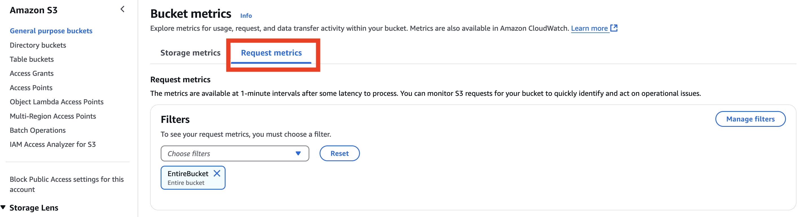

# Monitoring Amazon S3 Dataset Usage with Server Access Logs and CloudWatch Metrics

## Overview

The AWS Open Data Sponsorship Program covers the cost of Amazon S3 storage and data transfer for high-value, cloud-optimized public datasets. If your dataset has been accepted into the program, AWS will cover these costs for a period of two years, as outlined in the [Open Data Sponsorship Program Terms and Conditions](https://aws.amazon.com/opendata/open-data-sponsorship-program/terms/).

This guidance is intended for data providers who have already onboarded their dataset into the program and want to better understand their dataset's storage and request activity. By following this guidance, you’ll be able to answer key questions such as:

- How much storage is my dataset using?
- How many objects are stored in my bucket?
- How many requests are being made to my dataset?
- What objects are accessed most frequently?

This guide is divided into two parts:

- **Part 1**: Enable [S3 Server Access Logging](https://docs.aws.amazon.com/AmazonS3/latest/userguide/ServerLogs.html) to capture detailed, request-level information.
- **Part 2**: Explore [CloudWatch Storage and Request Metrics](https://docs.aws.amazon.com/AmazonS3/latest/userguide/cloudwatch-monitoring.html) for monitoring and analysis.

---

## What You'll Do

### Part 1: Server Access Logs

- Create the logging destination bucket.
- Enable server access logging on your dataset bucket.
- Set up a lifecycle rule to delete old logs.
- Test and validate that logging is working.

### Part 2: CloudWatch Metrics

- Explore CloudWatch S3 storage and request metrics.

---

## Prerequisites

- An existing Amazon S3 bucket containing your approved Open Data dataset.

> ⚠️ **Warning**: You must complete Step 3 (Set Up a Lifecycle Rule) if enabling logging. Failing to do so may result in loss of sponsorship eligibility.

---

## Part 1: Enable Server Access Logging

### Step 1: Create the Logging Destination Bucket

1. Sign in to the [Amazon S3 Console](https://console.aws.amazon.com/s3/) in the same AWS account and Region as your dataset bucket.
2. Select **Create bucket**.
3. Provide a unique name (e.g., `my-dataset-logs`).
4. Leave default settings and choose **Create bucket**.

### Step 2: Enable Server Access Logging

1. Navigate to your dataset bucket (not logging bucket) in the S3 Console.
2. Choose the **Properties** tab.
3. Scroll to **Server access logging** and choose **Edit**.
4. Enable logging and specify the logging destination bucket created in Step 1.
5. Save changes.

Refer to [official documentation](https://docs.aws.amazon.com/AmazonS3/latest/userguide/enable-server-access-logging.html) for detailed steps.

### (MUST COMPLETE) Step 3: Set Up a Lifecycle Rule

1. Open the destination logging bucket.
2. Navigate to the **Management** tab and select **Create lifecycle rule**.
3. Name your rule (e.g., `DeleteOldLogs`).
4. Under **Choose a rule scope**, select **Apply to all objects in the bucket** and acknowledge the impact.
5. Under **Lifecycle rule actions**, select **Expire current versions of objects**.
6. Set **Days after object creation** to `30` to delete logs 30 days after they are created.
7. Leave other settings as default and select **Create rule**.

### Step 4: Validate Logging

To confirm logs capture your requests:

1. Make GET requests to objects in your dataset bucket (via browser, curl, etc.).
2. Wait several hours.
3. Open the logging bucket and locate recent log files.
4. Confirm they contain details that correspond to your test requests, such as request time, requester’s IP, requested object, and response code.

**Congratulations! You’ve now successfully enabled server access logging for your Open Data dataset bucket and configured a lifecycle rule to manage log retention.**

To get the most value from these logs, you’ll likely want to analyze them. [Amazon Athena](https://aws.amazon.com/athena/) makes it easy to query server access logs using standard SQL, without the need to move or preprocess the data. This is a powerful way to uncover usage patterns, identify popular objects, and troubleshoot access issues.

> ⚠️ **Important**: All analysis of access logs must be performed outside of your sponsored Open Data account. Running compute workloads such as Athena queries is not permitted under the program’s terms.

For step-by-step examples of how to query S3 access logs with Athena, refer to the [AWS documentation](https://docs.aws.amazon.com/AmazonS3/latest/userguide/using-s3-access-logs-to-identify-requests.html#querying-s3-access-logs-for-requests).

---

## Part 2: Explore CloudWatch S3 Metrics

S3 Server Access Logs and CloudWatch metrics serve complementary purposes:

- **S3 Server Access Logs**: Ideal for detailed auditing, compliance, and usage analysis. Logs are stored in S3 and must be manually parsed or queried using tools like Amazon Athena for analysis.
- **CloudWatch Metrics**: Less detailed, but useful for near real-time monitoring, operational visibility, and automated alerting with 1-minute granularity.

**Best practice**: Use both tools together to gain a complete understanding of how your dataset is being stored and accessed.

### Step 1: View CloudWatch Storage Metrics

1. Select your dataset bucket in the S3 Console.
2. Navigate to the **Metrics** tab.
3. Click **View additional charts**.
4. Ensure the **Storage metrics** tab is selected.

_Fig 1. Select the Storage metrics tab on the Bucket metrics page._

Here, you can view:

- **Total bucket size**
- **Total number of objects**

_Fig 2. CloudWatch charts showing total bucket size and object count over two weeks._

Click **View in CloudWatch** for deeper exploration or time range adjustment. For a better understanding of the storage metrics, check this [CloudWatch S3 storage metrics chart](https://docs.aws.amazon.com/AmazonS3/latest/userguide/metrics-dimensions.html#s3-cloudwatch-metrics).

### Step 2: View CloudWatch Request Metrics

1. While still in the **Bucket Metrics** section, select the **Request metrics** tab.

_Fig 3. Select the Request metrics tab on the Bucket metrics page._

2. If you used the CloudFormation template from the [onboarding guide](https://assets.opendata.aws/aws-onboarding-handbook-for-data-providers-en-US.pdf) to create your dataset bucket, an **EntireBucket** filter should already exist.
3. If not, follow the [instructions to create a metrics configuration](https://docs.aws.amazon.com/AmazonS3/latest/userguide/configure-request-metrics-bucket.html) to create and select your filter.

Once selected, you’ll see metrics such as:

- GET/PUT/DELETE request counts
- 4xx/5xx errors
- Latency

Click **View in CloudWatch** for deeper exploration or time range adjustment. For a better understanding of the request metrics, check this [CloudWatch S3 request metrics chart](https://docs.aws.amazon.com/AmazonS3/latest/userguide/metrics-dimensions.html#s3-request-cloudwatch-metrics).

---

## Additional Resources

To deepen your understanding or extend the capabilities outlined in this guide, explore the following resources:

- [Understanding Amazon S3 Server Access Logs](https://docs.aws.amazon.com/AmazonS3/latest/userguide/ServerLogs.html)
- [Analyzing Access Logs with Amazon Athena](https://docs.aws.amazon.com/AmazonS3/latest/userguide/using-s3-access-logs-to-identify-requests.html#querying-s3-access-logs-for-requests)
- [Amazon S3 Metrics and Dimensions](https://docs.aws.amazon.com/AmazonS3/latest/userguide/metrics-dimensions.html)
- [Configuring CloudWatch metrics for Buckets](https://docs.aws.amazon.com/AmazonS3/latest/userguide/configure-request-metrics-bucket.html)
- [AWS Open Data Sponsorship Program](https://aws.amazon.com/opendata/open-data-sponsorship-program/)

---

## Summary

This guide walked you through setting up two foundational tools to help you monitor and understand usage of your Open Data dataset hosted on Amazon S3:

- **Amazon S3 Server Access Logs** provide request-level detail for audit trails, usage analysis, and security insights.
- **Amazon CloudWatch Metrics** deliver near real-time visibility into your bucket's storage footprint and access patterns, supporting proactive monitoring and alerting.

Together, these tools allow you to:

- Quantify dataset storage and usage trends
- Understand how and when your data is accessed
- Identify errors and operational issues in real time

By implementing this guidance, you’re equipped to manage your dataset more effectively, improve reliability, and demonstrate its value to the research and public data communities.
