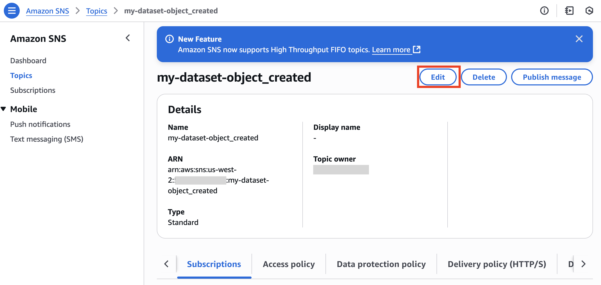

# Onboard to the Open Data Program and Set Up Update Notifications

## Overview

The AWS Open Data Sponsorship Program covers the cost of Amazon S3 storage and data transfer for high-value, cloud-optimized public datasets. If your dataset has been accepted into the program, AWS will cover these costs for a period of two years, as outlined in the [Open Data Sponsorship Program Terms and Conditions](https://aws.amazon.com/opendata/open-data-sponsorship-program/terms/).

This guidance is intended for data providers who have been accepted into the program and are onboarding their dataset. As part of this process, you will:

- Set up an Amazon S3 bucket for public data access.
- Create an Amazon SNS topic to notify data consumers when new objects are added.
- Optionally test this setup with an Amazon SQS queue or AWS Lambda function in a **separate** AWS account.

> **Important Notice:**  
> A [CloudFormation template](https://console.aws.amazon.com/cloudformation/home?region=us-west-2#/stacks/new?stackName=pds-buckets&templateURL=https://s3-us-west-2.amazonaws.com/opendata.aws/pds-bucket-cf.yml) provided in the [onboarding guide](https://assets.opendata.aws/aws-onboarding-handbook-for-data-providers-en-US.pdf) automates the creation of the S3 bucket and SNS topic. This guide is for providers who prefer to configure these resources manually or for data consumers looking to subscribe to notifications.

---

## What You’ll Do

You will:

- Create and configure a public S3 bucket to host your dataset.
- Set up an SNS topic that publishes notifications on new object uploads.
- (Optional) Test cross-account subscriptions using SQS and Lambda.

---

## Prerequisites

Before starting:

- The S3 bucket and SNS topic must be in the **same AWS Region**. For geospatial datasets, we recommend `us-west-2` unless otherwise required. While customers often host their datasets in `us-west-2` or `us-east-1`, we recommend choosing a region that aligns with the location of your primary compute resources. This approach minimizes latency and optimizes performance. Consider your specific use case and geographical needs when selecting the ideal region for your S3 bucket.
- Data consumer resources (SQS or Lambda) can be in different regions.
- You must have already created and linked your dataset AWS account to the internal AWS account managing the sponsorship.
- To test cross-account functionality, use a **separate** AWS account not associated with the Open Data Program.
- ⚠️ **Warning:** This setup makes your S3 bucket public. Do **NOT** proceed unless you intend for the data to be accessible to everyone.

---

## Step 1: Create the S3 Bucket

1. In your Open Data Program (ODP) AWS account, open the [Amazon S3 console](https://console.aws.amazon.com/s3/).
2. Ensure you're operating in the appropriate region.
3. Choose **Create bucket**.
4. Enter a unique bucket name (e.g., `my-dataset-bucket`).
5. Under **Object Ownership**, choose **ACLs disabled**.
6. Under **Block Public Access settings**, uncheck **Block all public access**. A warning will appear indicating that the bucket can be made public.
7. Acknowledge the warning prompt to confirm public access.
8. Leave the remaining settings as default, and select **Create bucket**.

---

## Step 2: Configure the S3 Bucket for Public Access

1. Open your bucket in the S3 console and go to the **Permissions** tab.
2. Choose **Edit** under **Bucket policy**.
3. Replace the contents with the following policy (replace `<my-dataset-bucket>` with your bucket's name):

```json
{
  "Version": "2012-10-17",
  "Statement": [
    {
      "Effect": "Allow",
      "Principal": "*",
      "Action": [
        "s3:Get*",
        "s3:List*"
      ],
      "Resource": [
        "arn:aws:s3:::<my-dataset-bucket>",
        "arn:aws:s3:::<my-dataset-bucket>/*"
      ]
    }
  ]
}
```

4. Select **Save changes**. This policy allows any user to list and retrieve objects in your bucket, making it publicly accessible.

---

## Step 3: Create an SNS Topic

1. Open the [Amazon SNS console](https://console.aws.amazon.com/sns/).

   
2. From the left navigation pane, choose **Topics**, then select **Create topic**.

   
3. For **Type**, select **Standard**.

   
4. In the **Name** field, provide a name for your topic (e.g., `my-dataset-object_created`).

   
5. Leave the remaining settings as default and choose **Create topic**.

   
---

## Step 4: Update the SNS Topic's Access Policy

1. In the SNS console, open the topic you created and take note of its **ARN**.

   
2. Choose **Edit**, then expand **Access Policy – optional**.

   

   
3. Replace the default access policy with the following JSON to allow the S3 bucket to publish events to this topic. Update `<SNS-topic-ARN>` , `<aws-account-id>`, and `<my-dataset-bucket>` with your SNS topic ARN, AWS account ID, and S3 bucket name, respectively.
```json
{
  "Version": "2012-10-17",
  "Statement": [
    {
      "Sid": "AllowS3BucketToPublish",
      "Effect": "Allow",
      "Principal": {
        "Service": "s3.amazonaws.com"
      },
      "Action": "sns:Publish",
      "Resource": "<SNS-topic-ARN>",
      "Condition": {
        "StringEquals": {
          "aws:SourceAccount": "<aws-account-id>"
        },
        "ArnLike": {
          "aws:SourceArn": "arn:aws:s3:::<my-dataset-bucket>"
        }
      }
    },
    {
      "Sid": "AllowOnlySQSLambdaSubscriptions",
      "Effect": "Allow",
      "Principal": {
        "AWS": "*"
      },
      "Action": [
        "sns:Subscribe",
        "sns:Receive"
      ],
      "Resource": "<SNS-topic-ARN>",
      "Condition": {
        "StringEquals": {
          "SNS:Protocol": [
            "sqs",
            "lambda"
          ]
        }
      }
    }
  ]
}
```

4. Select **Save changes**.

   

---

## Step 5: Configure S3 Event Notifications

1. In the S3 console, select your bucket and go to the **Properties** tab.

   
2. Scroll to **Event notifications**, then choose **Create event notification**.

   
3. Name the event (e.g., `ObjectCreatedNotification`).

   
4. For **Event types**, select **All object create events** to trigger the notification whenever a new object is added to the bucket.

   
5. For **Destination**, choose **SNS topic**, then select the one you created.

   
6. Select **Save changes**.

> ✅ Your S3 bucket is now configured to publish object creation events to an SNS topic.

---

## Step 6: (Optional) Test with Amazon SQS

1. In a **separate AWS account (NOT the ODP account)**, open the [Amazon SQS console](https://console.aws.amazon.com/sqs/).
2. Create a **Standard queue** and leave default settings.
3. Go to the **SNS subscriptions** tab of the queue, and select **Subscribe to Amazon SNS topic**.
4. Enter the SNS topic ARN from your ODP account and save.
5. In the ODP account, upload a test object to your S3 bucket.
6. Return to the SQS queue and choose **Send and receive messages > Poll for messages**.
7. You should see a message with details about the new S3 object. This confirms that the notification is properly set up.

---

## Step 7: (Optional) Test with AWS Lambda

1. In a **separate AWS account (NOT the ODP account)**, open the [AWS Lambda console](https://console.aws.amazon.com/lambda/).
2. Choose **Create function** and select **Author from scratch**.
3. Provide a name and select **Python** as the runtime. Leave other settings as default and choose **Create function**.
4. Replace the default code with:

```python
import json

def lambda_handler(event, context):
    print("Received event:", json.dumps(event, indent=2))
    return {
        'statusCode': 200,
        'body': json.dumps('Event processed successfully')
    }
```

5. Select **Deploy** to save changes.
6. Within the Lambda function, select **Add trigger** > **SNS** > paste in the SNS topic ARN.
7. Upload a test object to the S3 bucket in your ODP account.
8. In the Lambda function, go to the **Monitor** tab > **View logs in CloudWatch**.
9. Confirm the event is received in the log stream.

---

## Additional Resources

- [Amazon S3 Documentation](https://docs.aws.amazon.com/AmazonS3/latest/userguide/Welcome.html)
- [Amazon SNS Documentation](https://docs.aws.amazon.com/sns/latest/dg/welcome.html)
- [Amazon SQS Documentation](https://docs.aws.amazon.com/AWSSimpleQueueService/latest/SQSDeveloperGuide/welcome.html)
- [AWS Lambda Documentation](https://docs.aws.amazon.com/lambda/latest/dg/welcome.html)

---

By following this guidance, your dataset will be publicly accessible and data consumers will be able to subscribe to real-time notifications, enabling event-driven data workflows.
